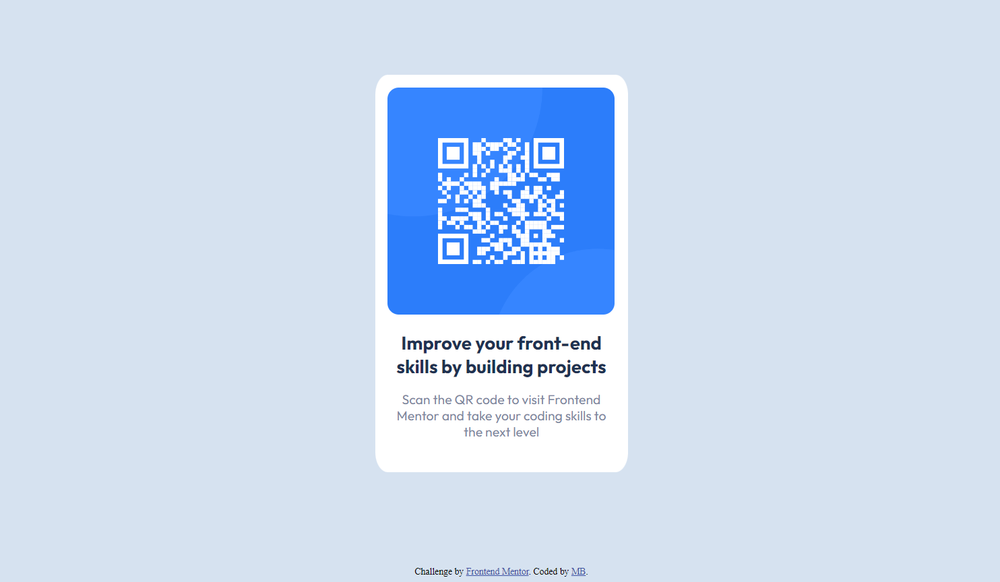

# Frontend Mentor - QR code component solution

This is a solution to the [QR code component challenge on Frontend Mentor](https://www.frontendmentor.io/challenges/qr-code-component-iux_sIO_H). Frontend Mentor challenges help you improve your coding skills by building realistic projects. 

## Table of contents

- [Overview](#overview)
  - [Screenshot](#screenshot)
  - [Links](#links)
- [My process](#my-process)
  - [Built with](#built-with)
  - [What I learned](#what-i-learned)
  - [Continued development](#continued-development)
  - [Useful resources](#useful-resources)
- [Author](#author)

## Overview

### Screenshot

 

### Links

- Solution URL: https://github.com/baxtro/qr-code-component
- Live Site URL: https://baxtro.github.io/qr-code-component/

## My process

### Built with

- HTML
- CSS 

I wrote the code using Atom editor.

### What I learned

Just getting started here with html and css. Just figuring out how to create the background shape, and add and center the image and text inside was quite challenging!

### Continued development

The next module in the class I'm slowly taking is on Bootstrap, but I am going to try my hand at more of these html/css challenges before moving on. I still don't really understand concepts such as absolute vs relative positioning, and when things need to be displayed inline vs. block. 

### Useful resources

- I found myself at https://www.w3schools.com/ and https://developer.mozilla.org/en-US/ frequently to try and resolve issues I was having. I find the W3 Schools "try it" editor really helpful for understanding and tinkering with concepts.

## Author

- Frontend Mentor - [@baxtro](https://www.frontendmentor.io/profile/baxtro)

